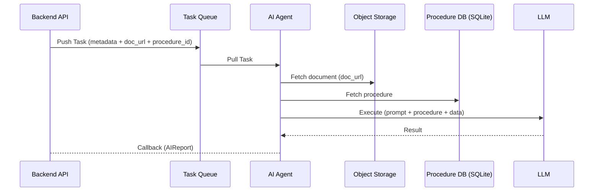
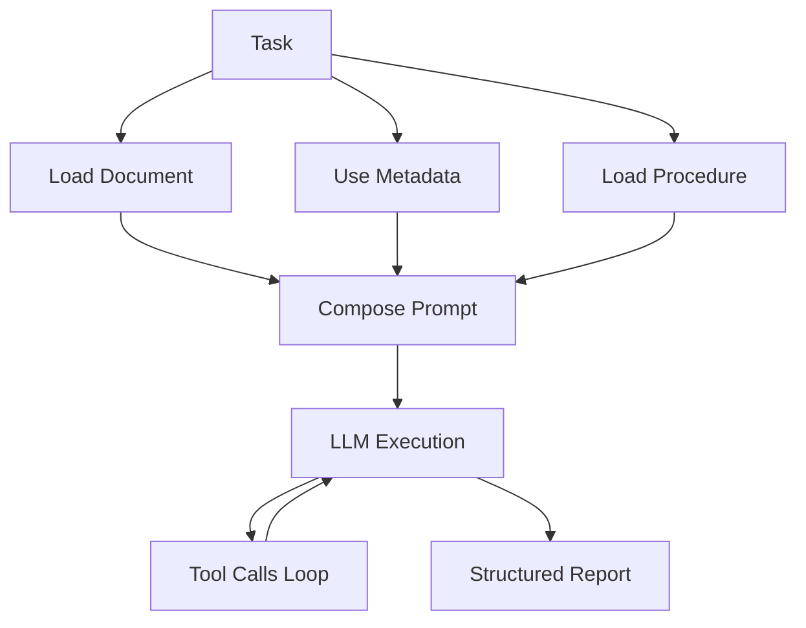
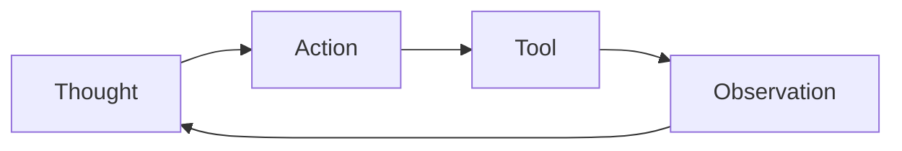
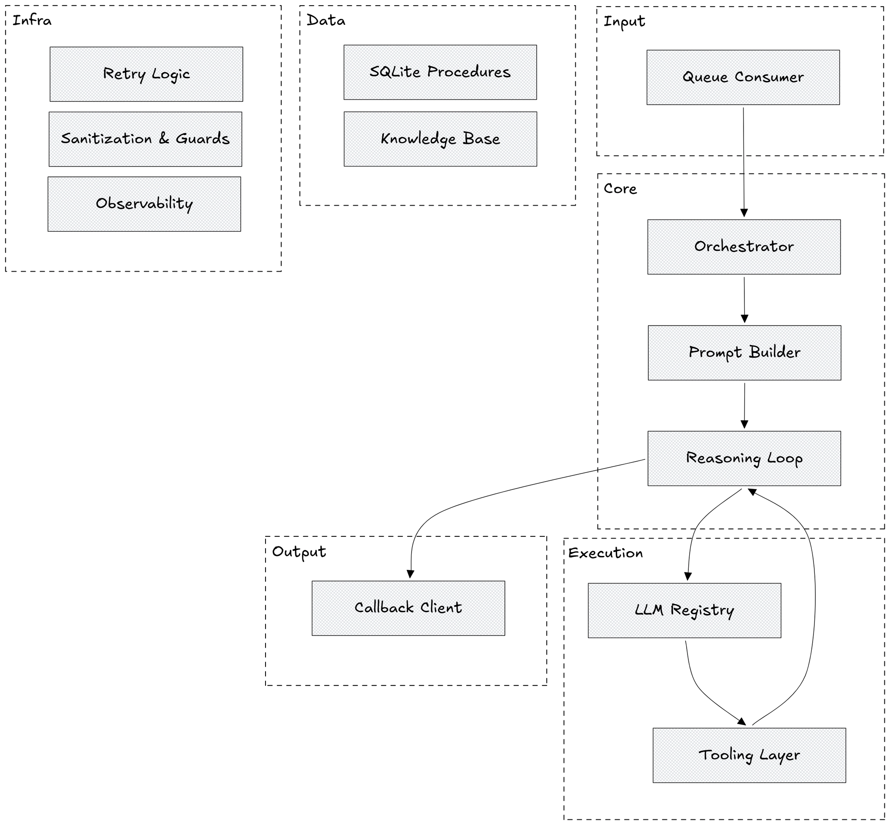
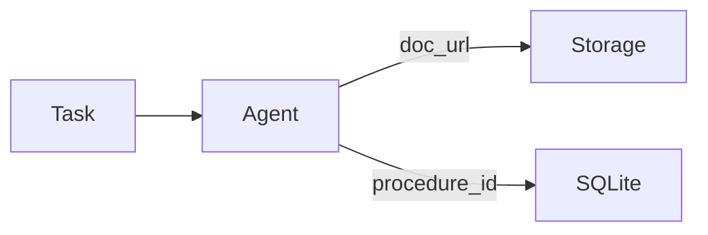

## **1. Overview**

The AI agent in the system acts as an **isolated task executor (worker)** that processes applications based on externally defined procedures.

An important property of the architecture is that the agent **does not own the system state** and does not participate in managing the application lifecycle. It does not store history, does not synchronize with the backend database, and does not make assumptions about the global system state.

Instead, the agent receives a **self-sufficient task**, interprets it in the context of the procedure, and returns the result as a structured report.

Thus, the agent can be viewed as:

> **procedure interpreter + tool executor + report generator**
> 

## **2. Data & Control Flow**

Key clarification:

- **application metadata is passed directly in the task**
- **the document is loaded by URL from Object Storage**
- **the procedure is extracted from the agent's SQLite**

This eliminates the agent's dependency on backend storage.



## **3. Execution Model**

Task processing is built as a **one-time execution pipeline** that does not rely on external state.



The key idea here is **runtime context composition**:

- metadata is already in memory
- the document is pulled by reference
- the procedure is loaded locally

The agent does not make additional requests to the backend.

## **4. Procedure as Runtime Logic**

The procedure is not just configuration, but the **main carrier of system business logic**.

It is stored in two parts:

- SQLite → procedure metadata
- file (media storage) → instruction text

When executing a task, the procedure is interpreted by the LLM as an **action plan**.

### **4.1 Structural Role of the Procedure**

The procedure defines:

- which data is important
- which checks need to be performed
- which tools to use
- which correctness criteria to apply
- which result to form

At the same time:

> the procedure does not fix an algorithm, but defines **intent and processing boundaries**
> 

### **4.2 How the Agent "Sees" the Procedure**

During execution, everything comes down to a single prompt:

```
You are an AI agent processing bureaucratic applications.

Here is the application data:
{metadata + document}

Here is the procedure:
{instruction file}

Perform the check and return the result in the specified format.
```

Then the LLM:

- interprets the steps
- decides which tools to call
- determines the order of actions

## **5. Agent Reasoning Loop**

Inside, the agent works not linearly, but through an **iterative "thought → action → observation" cycle**.



Example:

- "Need to extract name" → OCR
- "Need to compare" → comparison
- "Not enough data" → attempt to find elsewhere

This cycle continues until the final result is formed.

## **6. Internal Architecture**

The agent is organized as a set of layers, each responsible for its part of the pipeline.


## **7. Tools & Capabilities**

The agent does not "know" how to process documents directly — it does this through tools.

### **Tools**

- OCR (text extraction)
- reading document segments
- pattern search
- external mock API calls

### **LLM Level**

- data extraction
- comparison
- validation
- decision making

The separation is important:

> tools = actions
> 
> 
> LLM = reasoning + orchestration
> 

## **8. Data Isolation Model**



The agent:

- does not access PostgreSQL
- does not store data after execution
- works with a **local context snapshot**

This makes the system:

- simpler
- more secure
- more scalable

## **9. Reliability & Error Handling**

Processing is built with the understanding that errors are a normal part of the process.

### Retry Levels:

- queue (task retry)
- LLM calls
- tools
- callback

### Error Types:

- infrastructure
- tool-related
- logical (data)
- uncertainty

Key principle:

> the system allows **imperfect data and partial results**
> 

## **10. Observability**

The agent is fully traceable:

- all reasoning steps are logged
- tool calls are recorded
- intermediate states are saved
- evaluation through LLM-as-Judge is possible

This is critical because:

> the agent's behavior is determined by data, not code
> 

## **11. Design Principles**

- **Stateless processing** — absence of state
- **Declarative logic** — logic in procedures
- **Loose coupling** — independence from backend
- **Tool-driven architecture** — actions through tools
- **LLM as orchestrator** — execution management
- **Runtime composition** — all logic is assembled on the fly

## **12. Key Architectural Insight**

The main thing you have built here:

> **not just an AI service, but an interpretable procedure system**
> 

Where:

- the backend manages state
- the agent performs interpretation
- procedures define behavior
