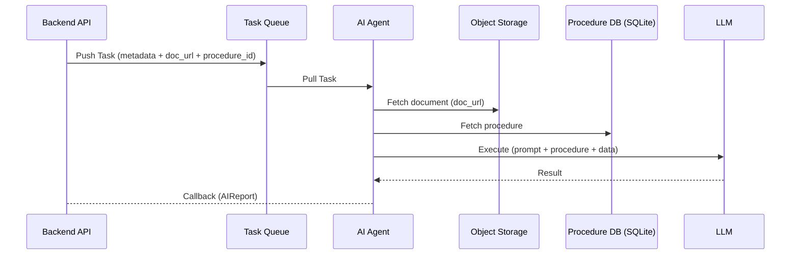
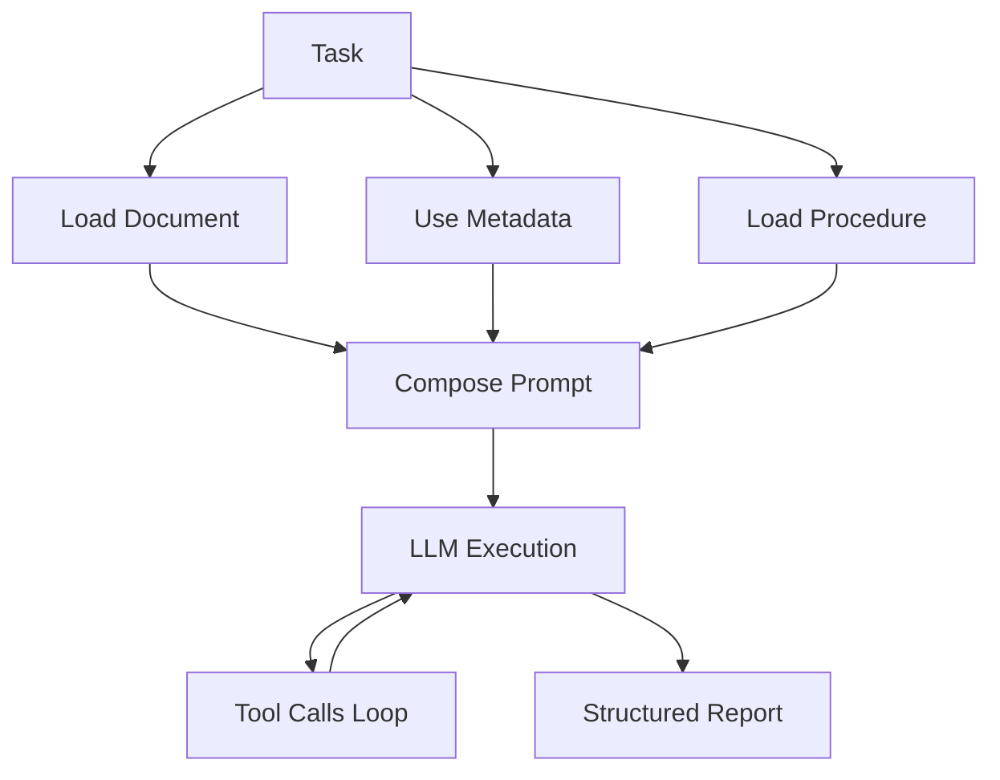
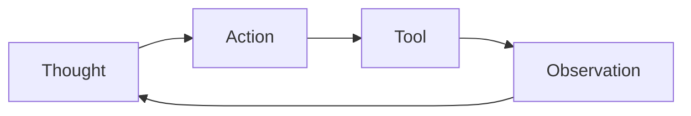
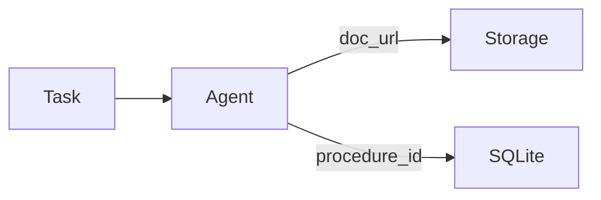

## **1. Overview**

AI-агент в системе выступает как **изолированный исполнитель задач (worker)**, который обрабатывает заявки на основе внешне заданных процедур.

Важное свойство архитектуры — агент **не владеет состоянием системы** и не участвует в управлении жизненным циклом заявки. Он не хранит историю, не синхронизируется с базой backend и не делает предположений о глобальном состоянии системы.

Вместо этого агент получает **самодостаточную задачу**, интерпретирует её в контексте процедуры и возвращает результат в виде структурированного отчета.

Таким образом, агент можно рассматривать как:

> **интерпретатор процедур + исполнитель инструментов + генератор отчета**
> 

## **2. Data & Control Flow**

Ключевое уточнение:

- **метаданные заявки передаются прямо в задаче**
- **документ загружается по URL из Object Storage**
- **процедура извлекается из SQLite агента**

Это устраняет зависимость агента от backend-хранилищ.



## **3. Execution Model**

Обработка задачи строится как **одноразовый execution pipeline**, который не опирается на внешнее состояние.



Ключевая идея здесь — **runtime-композиция контекста**:

- metadata уже в памяти
- документ подтягивается по ссылке
- процедура загружается локально

Агент не делает дополнительных запросов к backend.

## **4. Procedure as Runtime Logic**

Процедура — это не просто конфигурация, а **главный носитель бизнес-логики системы**.

Она хранится в двух частях:

- SQLite → метаданные процедуры
- файл (media storage) → текст инструкции

При выполнении задачи процедура интерпретируется LLM как **план действий**.

### **4.1 Структурная роль процедуры**

Процедура задаёт:

- какие данные важны
- какие проверки нужно выполнить
- какие инструменты использовать
- какие критерии корректности применить
- какой результат сформировать

При этом:

> процедура не фиксирует алгоритм, а задаёт **намерение и рамки обработки**
> 

### **4.2 Как агент «видит» процедуру**

Во время выполнения всё сводится к единому промпту:

```
Ты — AI-агент, обрабатывающий бюрократические заявки.

Вот данные заявки:
{metadata + document}

Вот процедура:
{instruction file}

Выполни проверку и верни результат в заданном формате.
```

Дальше LLM:

- интерпретирует шаги
- решает, какие инструменты вызвать
- определяет порядок действий

## **5. Agent Reasoning Loop**

Внутри агент работает не линейно, а через **итеративный цикл “мысль → действие → наблюдение”**.



Пример:

- «Нужно извлечь ФИО» → OCR
- «Нужно сравнить» → сравнение
- «Недостаточно данных» → попытка найти в другом месте

Этот цикл продолжается до формирования финального результата.

## **6. Internal Architecture**

Агент организован как набор слоев, каждый из которых отвечает за свою часть пайплайна.


## **7. Tools & Capabilities**

Агент не «знает» как обрабатывать документы напрямую — он делает это через инструменты.

### **Инструменты**

- OCR (извлечение текста)
- чтение сегментов документа
- поиск по паттернам
- вызовы внешнего mock API

### **LLM-уровень**

- извлечение данных
- сравнение
- валидация
- принятие решений

Разделение важно:

> инструменты = действия
> 
> 
> LLM = reasoning + orchestration
> 

## **8. Data Isolation Model**



Агент:

- не обращается к PostgreSQL
- не хранит данные после выполнения
- работает с **локальным snapshot контекста**

Это делает систему:

- проще
- безопаснее
- масштабируемее

## **9. Reliability & Error Handling**

Обработка строится с учетом того, что ошибки — нормальная часть процесса.

### Уровни retry:

- очередь (task retry)
- LLM вызовы
- инструменты
- callback

### Типы ошибок:

- инфраструктурные
- инструментальные
- логические (данные)
- неопределенность

Ключевой принцип:

> система допускает **неидеальные данные и частичные результаты**
> 

## **10. Observability**

Агент полностью трассируем:

- логируются все шаги reasoning
- фиксируются tool calls
- сохраняются промежуточные состояния
- возможна оценка через LLM-as-Judge

Это критично, потому что:

> поведение агента определяется данными, а не кодом
> 

## **11. Design Principles**

- **Stateless processing** — отсутствие состояния
- **Declarative logic** — логика в процедурах
- **Loose coupling** — независимость от backend
- **Tool-driven architecture** — действия через инструменты
- **LLM as orchestrator** — управление выполнением
- **Runtime composition** — вся логика собирается на лету

## **12. Key Architectural Insight**

Главное, что ты здесь построил:

> **не просто AI-сервис, а интерпретируемую систему процедур**
> 

Где:

- backend управляет состоянием
- агент выполняет интерпретацию
- процедуры определяют поведение