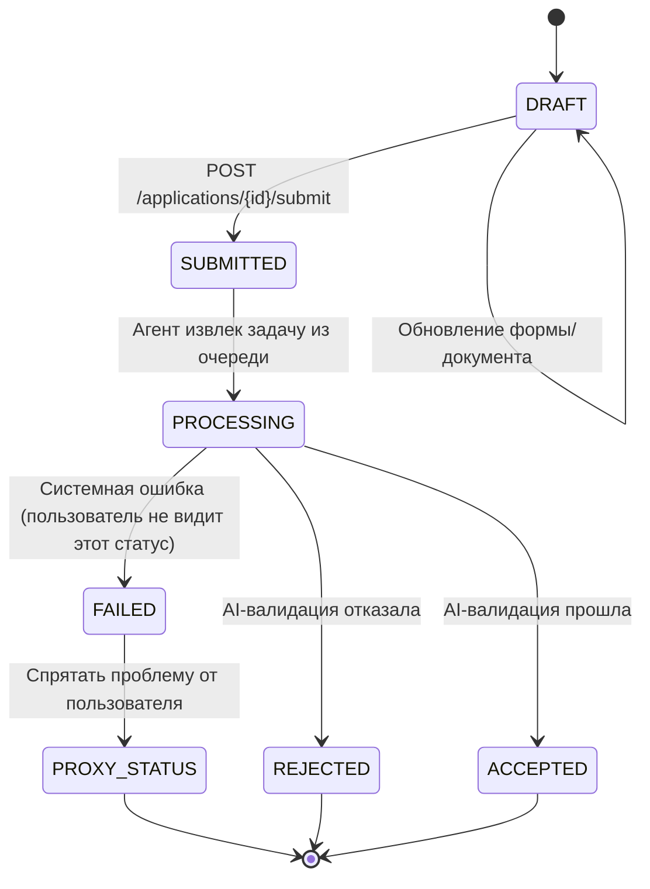

## **1. Overview**

Жизненный цикл заявки моделируется как конечный автомат с фиксированными состояниями — от создания до результата обработки.

Каждая заявка:

- обрабатывается один раз,
- не поддерживает повторную отправку,
- завершается в одном из финальных состояний.

## **2. State Diagram**

## **3. States**

- **DRAFT** — создание и редактирование заявки
- **SUBMITTED** — заявка прошла первичную валидацию и отправлена на обработку
- **PROCESSING** — агент обрабатывает заявку
- **FAILED (internal)** — системная ошибка (не показывается пользователю)
- **REJECTED** — заявка отклонена по результатам AI-валидации
- **ACCEPTED** — заявка успешно прошла проверку
- **PROXY_STATUS** — пользовательское представление ошибки

## **4. Flow Summary**

1. `DRAFT → SUBMITTED` — пользователь отправляет заявку
2. `SUBMITTED → PROCESSING` — агент начинает обработку
3. Далее возможны исходы:
    - `PROCESSING → ACCEPTED`
    - `PROCESSING → REJECTED`
    - `PROCESSING → FAILED → PROXY_STATUS`

Финальные состояния: `ACCEPTED`, `REJECTED`, `PROXY_STATUS`.

## **5. Notes**

- Backend — единственный источник истины для статуса
- `FAILED` используется только внутри системы
- Модель упрощена за счет отсутствия retry / resubmission