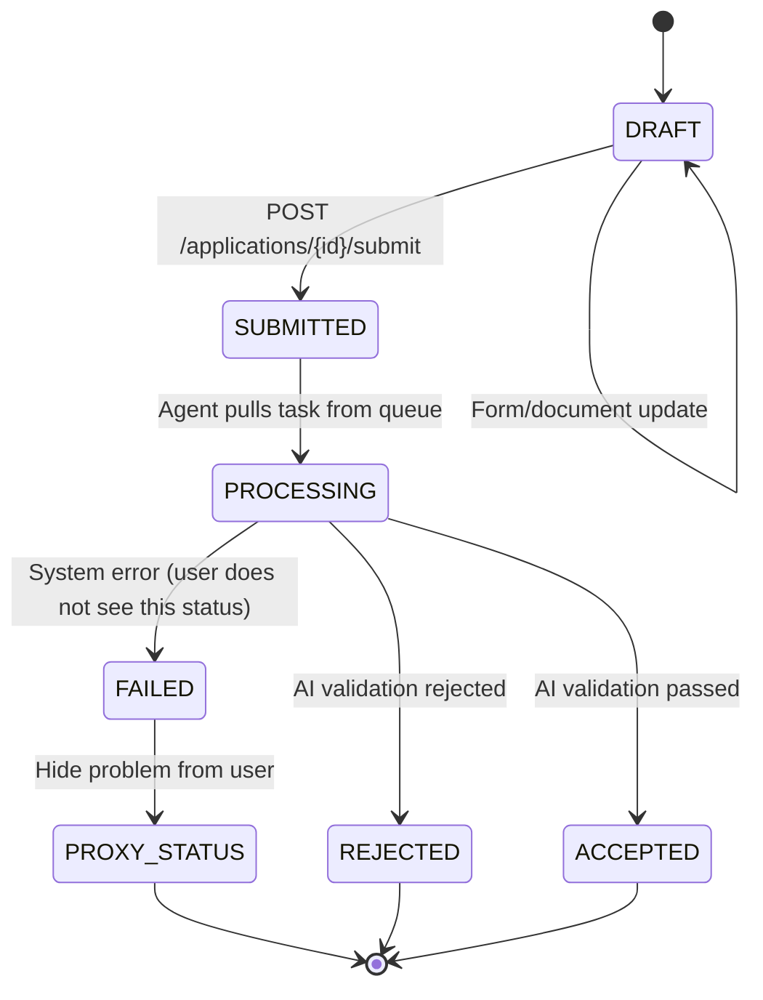

## **1. Overview**

The application lifecycle is modeled as a finite state machine with fixed states — from creation to processing result.

Each application:

- is processed once,
- does not support resubmission,
- ends in one of the final states.

## **2. State Diagram**

## **3. States**

- **DRAFT** — application creation and editing
- **SUBMITTED** — application passed initial validation and sent for processing
- **PROCESSING** — agent is processing the application
- **FAILED (internal)** — system error (not shown to user)
- **REJECTED** — application rejected based on AI validation results
- **ACCEPTED** — application successfully passed verification
- **PROXY_STATUS** — user-facing error representation

## **4. Flow Summary**

1. `DRAFT → SUBMITTED` — user submits the application
2. `SUBMITTED → PROCESSING` — agent starts processing
3. Possible outcomes:
    - `PROCESSING → ACCEPTED`
    - `PROCESSING → REJECTED`
    - `PROCESSING → FAILED → PROXY_STATUS`

Final states: `ACCEPTED`, `REJECTED`, `PROXY_STATUS`.

## **5. Notes**

- Backend is the single source of truth for status
- `FAILED` is used only internally within the system
- The model is simplified by the absence of retry / resubmission
