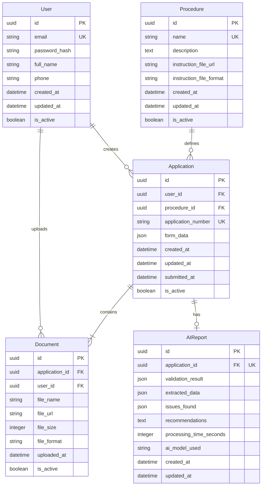

This document supplements the general requirements description and formalizes the system data model, describing key entities: **User, Application, Document, Procedure.**

---

## **0. Context**

The document is created as part of the **Bureaucratic AI Agent** educational project design — a platform for automating bureaucratic procedures with an AI agent, including:

- authentication via email/password,
- application creation (Application) with document upload,
- automatic application processing by AI agent,
- status tracking and feedback,
- knowledge base about procedures.

Below are described **data structures**, **ownership rules**, **lifecycle**, and **constraints** for each entity.

---

## **1. User**

### **1.1 Purpose**

The User represents a citizen submitting applications for bureaucratic procedures.

### **1.2 Fields (Draft Schema)**

- `id` — UUID, primary key
- `email` — string, unique, used for login
- `password_hash` — string, password hash (bcrypt/argon2)
- `full_name` — string, user's full name
- `phone` — string, optional
- `created_at` — datetime
- `updated_at` — datetime
- `is_active` — boolean, for soft delete
- `is_verified` — boolean, whether email is verified
- `last_login_at` — datetime, optional

### **1.3 Behavior Rules**

- User cannot view other users' applications (strict isolation by `user_id`)
- Login via email + password (JWT tokens)
- Soft-delete removes:
    - the user themselves,
    - their applications (Application),
    - their documents (Document).

### **1.4 Relationships**

- User **1 → 0…N** Application
- User **1 → 0…N** Document (through Application)

### **1.5 Indexes**

- `email` (unique)
- `is_active`
- `created_at`

---

## **2. Procedure**

### **2.1 Purpose**

**Procedure** is a **lightweight wrapper** around a text document with instructions for the AI agent. It contains minimal metadata and a reference to a document with a full description of the procedure.

### **2.2 Fields (Draft Schema)**

- `id` — UUID
- `name` — string, procedure name (e.g., "Passport Application MD")
- `description` — text, brief description (1-2 sentences)
- `instruction_file_url` — string, path to the instruction file for the AI agent (S3/local storage)
- `instruction_file_format` — string, file format (TXT, MD, PDF)
- `created_at` — datetime
- `updated_at` — datetime
- `is_active` — boolean

### **2.3 Behavior Rules**

- Procedures are created through **seed data / migrations** (no UI for management)
- Users can only **view the list of procedures** and select them when creating an application
- The AI agent **reads the instruction file** (`instruction_file_url`) to understand how to process the application
- The instruction file contains:
    - Required documents
    - Validation rules
    - Checklist for verification
    - Prompts for the AI agent
    - Examples of correct applications

### **2.4 Constraints**

- Procedure name must be **unique**
- `instruction_file_url` cannot be empty
- A procedure cannot be deleted if there are active applications

### **2.5 Relationships**

- Procedure 1 → 0…N Application

### **2.6 Indexes**

- `name` (unique)
- `is_active`

### **2.7 Example Instruction File Structure**

**File:** `procedures/passport_application.md`

```
# Procedure: Passport Application MD

## Required Documents
1. Birth Certificate (PDF/JPG)
2. Photo 3x4 (JPG/PNG)
3. Application Form 1P (PDF/DOCX)

## Validation Rules
- Name in the application must match the name in the birth certificate
- Photo must be color, size 3x4 cm
- All documents must be readable (not blurry)

## AI Agent Checklist
- [ ] Check that all 3 documents are present
- [ ] Extract name from birth certificate (OCR)
- [ ] Extract name from application (OCR)
- [ ] Compare names (must match)
- [ ] Check photo quality

## AI Agent Prompt
"You are an assistant for checking passport applications for MD.
Check that all documents are uploaded, extract names from documents
and ensure they match. If there are issues, describe them in clear language."

## Example Issues
- "Name in application (Ivanov Ivan Ivanovich) does not match name in certificate (Ivanov I.I.)"
- "Photo 3x4 is missing"
- "Birth certificate is unreadable (blurry image)"
```

---

## **3. Application**

### **3.1 Purpose**

**Application** is a user's application for a specific procedure. It contains form data and uploaded documents.

### **3.2 Fields (Draft Schema)**

- `id` — UUID
- `user_id` — foreign key to User
- `procedure_id` — foreign key to Procedure
- `application_number` — string, unique application number (format: `APP-YYYYMMDD-XXXXX`)
- `form_data` — JSON, filled form data
- `created_at` — datetime
- `updated_at` — datetime
- `submitted_at` — datetime, when the application was submitted
- `is_active` — boolean

### **3.3 Behavior Rules**

- The application belongs to only one user
- The user can:
    - create an application (procedure selection)
    - fill out the form
    - upload documents
    - submit the application for processing
    - view the AI agent report
- Upon soft-delete of Application, all related Document and AIReport are also marked as deleted

### **3.4 Constraints**

- Minimum 1 document must be uploaded before submission
- Maximum 10 documents per application (NFR-011)
- An application cannot exist without an owner and procedure

### **3.5 Relationships**

- `Application N → 1 User`
- `Application N → 1 Procedure`
- `Application 1 → 1…N Document`
- `Application 1 → 0…1 AIReport`

### **3.6 Indexes**

- `user_id`
- `procedure_id`
- `application_number` (unique)
- `created_at`
- `submitted_at`

---

## **4. Document**

### **4.1 Purpose**

**Document** represents a physical document file uploaded by the user to an application.

### **4.2 Fields (Draft Schema)**

- `id` — UUID
- `application_id` — foreign key to Application
- `user_id` — duplicate FK for convenient filtering
- `file_name` — string, original file name
- `file_url` — string, path to file in S3
- `file_size` — integer, size in bytes
- `file_format` — string, file format (PDF, DOCX, JPG, PNG)
- `uploaded_at` — datetime
- `is_active` — boolean

### **4.3 Behavior Rules**

- The document belongs to one application
- Deleting an Application deletes all Documents
- The user can upload files in batch (multi-upload)
- The AI agent extracts data from documents (OCR/parsing)

### **4.4 Constraints**

- Maximum file size: **10 MB**
- Allowed formats: **PDF, DOCX, JPG, PNG**
- Maximum number of documents: **10**

### **4.5 Relationships**

- `Document N → 1 Application`
- `Document N → 1 User`

### **4.6 Indexes**

- `application_id`
- `user_id`
- `uploaded_at`

---

## **5. AIReport**

### **5.1 Purpose**

**AIReport** is the result of processing an application by the AI agent. The user can view this report.

### **5.2 Fields (Draft Schema)**

- `id` — UUID
- `application_id` — foreign key to Application (unique)
- `validation_result` — JSON, result of completeness check
- `extracted_data` — JSON, data extracted from documents (OCR)
- `issues_found` — JSON/Array, list of found issues
- `recommendations` — text, recommendations for the user
- `processing_time_seconds` — integer, processing time
- `ai_model_used` — string, model (`gpt-4`, `gpt-3.5-turbo`)
- `created_at` — datetime
- `updated_at` — datetime

### **5.3 Behavior Rules**

- The report is created by the AI agent after processing the application
- One report per application (1:1)
- The user can view the report
- The report can be updated upon reprocessing

### **5.4 Relationships**

- `AIReport 1 → 1 Application`

### **5.5 Indexes**

- `application_id` (unique)
- `created_at`

---

## **6. Entity Lifecycle**

### **6.1 User**

```
login → create applications → soft delete → inaccessible
```

### **6.2 Procedure**

```
created (via seed) → available → updated (via migration) → deactivated
```

### **6.3 Application**

```
created → form filled → documents uploaded → submitted →
AI processing → report generated → viewable by user
```

### **6.4 Document**

```
uploaded → validated → available → [deleted with application]
```

### **6.5 AIReport**

```
created (after AI processing) → available → [updated on reprocessing]
```

---

## 7. ER Diagram (Mermaid)



---

## 8. Relationship Summary

| Relationship | Type | Description |
| --- | --- | --- |
| User → Application | 1:N | A user can create many applications |
| User → Document | 1:N | A user can upload many documents (through applications) |
| Procedure → Application | 1:N | A procedure can be used in many applications |
| Application → Document | 1:N | An application contains minimum 1, maximum 10 documents |
| Application → AIReport | 1:0..1 | An application can have one AI agent report (or none) |
