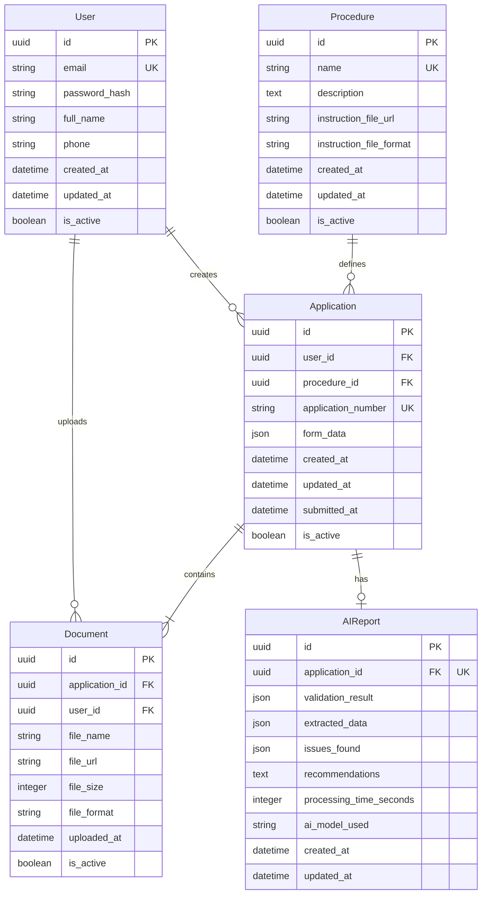

Этот документ дополняет общее описание требований и формализует модель данных системы, описывая ключевые сущности: **User, Application, Document, Procedure.**

---

## **0. Контекст**

Документ создаётся в рамках проектирования учебного проекта **Bureaucratic AI Agent** — платформы для автоматизации бюрократических процедур с AI-агентом, включающей:

- аутентификацию через email/password,
- создание заявок (Application) с загрузкой документов,
- автоматическую обработку заявок AI-агентом,
- отслеживание статусов и получение обратной связи,
- базу знаний о процедурах.

Ниже описаны **структуры данных**, **правила владения**, **жизненный цикл**, и **ограничения** для каждой сущности.

---

## **1. User (Пользователь)**

### **1.1 Назначение**

Пользователь представляет гражданина, подающего заявки на бюрократические процедуры.

### **1.2 Поля (Draft Schema)**

- `id` — UUID, первичный ключ
- `email` — строка, уникальная, используется для входа
- `password_hash` — строка, хеш пароля (bcrypt/argon2)
- `full_name` — строка, полное имя пользователя
- `phone` — строка, опционально
- `created_at` — datetime
- `updated_at` — datetime
- `is_active` — boolean, для soft delete
- `is_verified` — boolean, верифицирована ли почта
- `last_login_at` — datetime, опционально

### **1.3 Правила поведения**

- Пользователь не может видеть чужие заявки (строгая изоляция по `user_id`)
- Вход через email + password (JWT токены)
- Soft-delete удаляет:
    - самого пользователя,
    - его заявки (Request),
    - его документы (Document).

### **1.4 Связи**

- User **1 → 0…N** Application
- User **1 → 0…N** Document (через Application)

### **1.5 Индексы**

- `email` (unique)
- `is_active`
- `created_at`

---

## **2. Procedure (Процедура)**

### **2.1 Назначение**

**Procedure** — это **легковесная обертка** вокруг текстового документа с инструкциями для AI-агента. Содержит минимальные метаданные и ссылку на документ с полным описанием процедуры.

### **2.2 Поля (Draft Schema)**

- `id` — UUID
- `name` — строка, название процедуры (например, "Получение паспорта МД")
- `description` — текст, краткое описание (1-2 предложения)
- `instruction_file_url` — строка, путь к файлу с инструкциями для AI-агента (S3/локальное хранилище)
- `instruction_file_format` — строка, формат файла (TXT, MD, PDF)
- `created_at` — datetime
- `updated_at` — datetime
- `is_active` — boolean

### **2.3 Правила поведения**

- Процедуры создаются через **seed данные / миграции** (нет UI для управления)
- Пользователи могут только **просматривать список процедур** и выбирать их при создании заявки
- AI-агент **читает файл инструкций** (`instruction_file_url`) для понимания, как обрабатывать заявку
- Файл инструкций содержит:
    - Требуемые документы
    - Правила валидации
    - Чеклист для проверки
    - Промпты для AI-агента
    - Примеры корректных заявок

### **2.4 Ограничения**

- Название процедуры должно быть **уникальным**
- `instruction_file_url` не может быть пустым
- Процедура не может быть удалена, если есть активные заявки

### **2.5 Связи**

- Procedure 1 → 0…N Application

### **2.6 Индексы**

- `name` (unique)
- `is_active`

### **2.7 Пример структуры файла инструкций**

**Файл:** `procedures/passport_application.md`

```
# Процедура: Получение паспорта МД

## Требуемые документы
1. Свидетельство о рождении (PDF/JPG)
2. Фотография 3x4 (JPG/PNG)
3. Заявление по форме 1П (PDF/DOCX)

## Правила валидации
- ФИО в заявлении должно совпадать с ФИО в свидетельстве о рождении
- Фотография должна быть цветной, размером 3x4 см
- Все документы должны быть читаемыми (не размытыми)

## Чеклист для AI-агента
- [ ] Проверить наличие всех 3 документов
- [ ] Извлечь ФИО из свидетельства о рождении (OCR)
- [ ] Извлечь ФИО из заявления (OCR)
- [ ] Сравнить ФИО (должны совпадать)
- [ ] Проверить качество фотографии

## Промпт для AI-агента
"Ты — помощник по проверке заявок на получение паспорта МД. 
Проверь, что все документы загружены, извлеки ФИО из документов 
и убедись, что они совпадают. Если есть проблемы, опиши их понятным языком."

## Примеры проблем
- "ФИО в заявлении (Иванов Иван Иванович) не совпадает с ФИО в свидетельстве (Иванов И.И.)"
- "Отсутствует фотография 3x4"
- "Свидетельство о рождении нечитаемо (размытое изображение)"
```

---

## **3. Application (Заявка)**

### **3.1 Назначение**

**Application** — заявка пользователя на конкретную процедуру. Содержит данные формы и загруженные документы.

### **3.2 Поля (Draft Schema)**

- `id` — UUID
- `user_id` — внешний ключ на User
- `procedure_id` — внешний ключ на Procedure
- `application_number` — строка, уникальный номер заявки (формат: `REQ-YYYYMMDD-XXXXX`)
- `form_data` — JSON, данные заполненной формы
- `created_at` — datetime
- `updated_at` — datetime
- `submitted_at` — datetime, когда заявка была отправлена
- `is_active` — boolean

### **3.3 Правила поведения**

- Заявка принадлежит только одному пользователю
- Пользователь может:
    - создавать заявку (выбор процедуры)
    - заполнять форму
    - загружать документы
    - отправлять заявку на обработку
    - просматривать отчет AI-агента
- При soft-delete Application все связанные Document и AIReport также помечаются удаленными

### **3.4 Ограничения**

- Минимум 1 документ должен быть загружен перед отправкой
- Максимум 10 документов на заявку (NFR-011)
- Заявка не может существовать без владельца и процедуры

### **3.5 Связи**

- `Application N → 1 User`
- `Application N → 1 Procedure`
- `Application 1 → 1…N Document`
- `Application 1 → 0…1 AIReport`

### **3.6 Индексы**

- `user_id`
- `procedure_id`
- `application_number` (unique)
- `created_at`
- `submitted_at`

---

## **4. Document (Документ)**

### **4.1 Назначение**

**Document** представляет физический файл документа, загруженный пользователем к заявке.

### **4.2 Поля (Draft Schema)**

- `id` — UUID
- `application_id` — внешний ключ на Application
- `user_id` — дублирующий FK для удобства фильтрации
- `file_name` — строка, оригинальное имя файла
- `file_url` — строка, путь к файлу в S3
- `file_size` — integer, размер в байтах
- `file_format` — строка, формат файла (PDF, DOCX, JPG, PNG)
- `uploaded_at` — datetime
- `is_active` — boolean

### **4.3 Правила поведения**

- Документ принадлежит одной заявке
- Удаление Application удаляет все Document
- Пользователь может загружать файлы пакетно (multi-upload)
- AI-агент извлекает данные из документов (OCR/парсинг)

### **4.4 Ограничения**

- Максимальный размер файла: **10 МБ**
- Допустимые форматы: **PDF, DOCX, JPG, PNG**
- Максимальное количество документов: **10**

### **4.5 Связи**

- `Document N → 1 Application`
- `Document N → 1 User`

### **4.6 Индексы**

- `application_id`
- `user_id`
- `uploaded_at`

---

## **5. AIReport (Отчет AI-агента)**

### **5.1 Назначение**

**AIReport** — результат обработки заявки AI-агентом. Пользователь может просматривать этот отчет.

### **5.2 Поля (Draft Schema)**

- `id` — UUID
- `application_id` — внешний ключ на Application (unique)
- `validation_result` — JSON, результат проверки на полноту
- `extracted_data` — JSON, данные, извлеченные из документов (OCR)
- `issues_found` — JSON/Array, список найденных проблем
- `recommendations` — текст, рекомендации для пользователя
- `processing_time_seconds` — integer, время обработки
- `ai_model_used` — строка, модель (`gpt-4`, `gpt-3.5-turbo`)
- `created_at` — datetime
- `updated_at` — datetime

### **5.3 Правила поведения**

- Отчет создается AI-агентом после обработки заявки
- Один отчет на одну заявку (1:1)
- Пользователь может просматривать отчет
- Отчет может быть обновлен при повторной обработке

### **5.4 Связи**

- `AIReport 1 → 1 Application`

### **5.5 Индексы**

- `application_id` (unique)
- `created_at`

---

## **6. Жизненный цикл сущностей**

### **6.1 User**

```
login → create applications → soft delete → inaccessible
```

### **6.2 Procedure**

```
created (via seed) → available → updated (via migration) → deactivated
```

### **6.3 Application**

```
created → form filled → documents uploaded → submitted →
AI processing → report generated → viewable by user
```

### **6.4 Document**

```
uploaded → validated → available → [deleted with application]
```

### **6.5 AIReport**

```
created (after AI processing) → available → [updated on reprocessing]
```

---

## 7. ER-диаграмма (Mermaid)



---

## 8. Краткое описание связей

| Связь | Тип | Описание |
| --- | --- | --- |
| User → Application | 1:N | Пользователь может создать много заявок |
| User → Document | 1:N | Пользователь может загрузить много документов (через заявки) |
| Procedure → Application | 1:N | Процедура может быть использована в многих заявках |
| Application → Document | 1:N | Заявка содержит минимум 1, максимум 10 документов |
| Application → AIReport | 1:0..1 | Заявка может иметь один отчет AI-агента (или не иметь) |