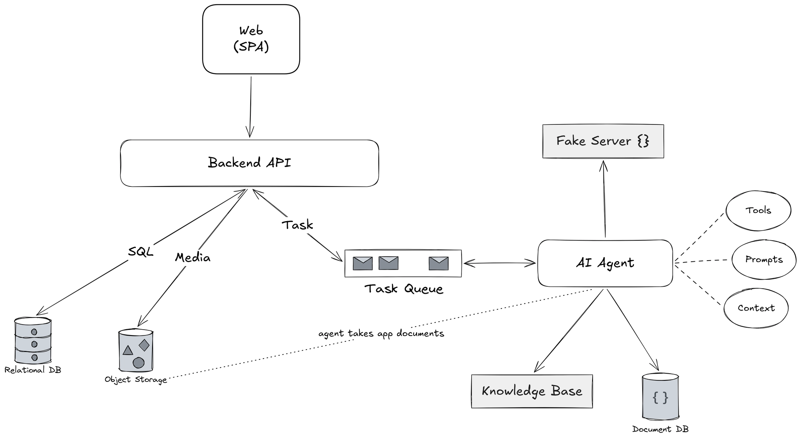

## **1. Overview**

Система предназначена для автоматизации обработки пользовательских заявок (applications), включающих метаданные и документы. Архитектура построена на разделении ответственности между backend, управляющим жизненным циклом заявки, и AI-агентом, выполняющим её обработку.

Ключевая идея системы — асинхронная обработка задач с явным контуром обратной связи: backend инициирует обработку, а агент по завершении возвращает результат через callback.

## **2. Architectural Approach**

Система построена вокруг асинхронного взаимодействия между компонентами через очередь сообщений.

Backend отвечает за:

- прием и хранение заявок,
- постановку задач на обработку,
- управление состоянием.

AI-агент выступает в роли независимого исполнителя (worker), который обрабатывает задачи и возвращает результат через **callback в backend**.

Именно callback-модель делает систему реактивной и позволяет backend оставаться источником истины (source of truth) для состояния заявок.

## **3. System Components**

### **3.1 Web Client (SPA)**

Пользователь взаимодействует с системой через веб-приложение, где он может создавать заявки, загружать документы и отслеживать статус их обработки.

Вся бизнес-логика сосредоточена на backend, а клиент отвечает только за отображение и отправку данных.

### **3.2 Backend API**

Backend является центральным оркестратором системы.

После получения заявки backend:

1. аутентифицирует пользователя и валидирует данные,
2. сохраняет метаданные в PostgreSQL,
3. загружает файл в Object Storage,
4. формирует задачу и отправляет её в очередь.

После обработки заявки агентом backend принимает результат через callback API. Получив отчет, backend:

- сохраняет его,
- обновляет статус заявки,
- инициирует уведомление пользователя (например, через SSE).

Таким образом, backend полностью контролирует состояние системы и не делегирует хранение состояния агенту.

### **3.3 Task Queue**

Очередь сообщений обеспечивает асинхронное взаимодействие между backend и агентом.

Она позволяет:

- обрабатывать задачи с задержкой,
- масштабировать воркеры,
- повторять выполнение при сбоях.

Очередь передает агенту только описание задачи и необходимые ссылки/идентификаторы, без переноса состояния.

### **3.4 AI Agent**

AI-агент является независимым воркером, который извлекает задачи из очереди и выполняет их.

Процесс обработки включает:

- получение и интерпретацию задачи,
- загрузку и анализ документа,
- выполнение валидаций и внешних проверок,
- формирование структурированного отчета.

После завершения обработки агент отправляет результат обратно в backend через **HTTP callback**. Это ключевой момент: агент не изменяет состояние напрямую, а сообщает результат, оставляя backend ответственным за фиксацию изменений.

### **3.5 Agent Logic and Data**

Логика обработки заявок задается через процедуры, хранящиеся в отдельной базе данных агента (SQLite). Это позволяет изменять поведение системы без модификации backend.

Агент использует:

- инструменты для обработки документов,
- механизмы валидации,
- внешние запросы к mock-сервису,
- knowledge base для контекста.

Такой подход делает обработку декларативной и расширяемой.

### **3.6 Data Storage**

Система использует несколько типов хранилищ:

- **PostgreSQL** — хранение пользователей, заявок и отчетов
- **Object Storage** — хранение файлов
- **SQLite (Agent DB)** — процедуры обработки
- **Knowledge Base / Document DB** — вспомогательные данные для агента

Разделение хранилищ позволяет независимо масштабировать разные части системы.

## **4. Data Flow**

Основной сценарий обработки:

1. Пользователь создает заявку через SPA
2. Backend сохраняет данные и файл
3. Backend отправляет задачу в очередь
4. AI-агент получает задачу и выполняет обработку
5. Агент отправляет результат в backend через callback
6. Backend сохраняет отчет и обновляет статус
7. Пользователь получает обновление

Ключевая особенность — **двусторонняя асинхронная коммуникация**: задача передается через очередь, а результат возвращается через callback.

## **5. Communication Model**

Система использует несколько моделей взаимодействия:

- синхронное: клиент ↔ backend (REST API)
- асинхронное: backend → очередь → агент
- обратный вызов: агент → backend (HTTP callback)
- push-уведомления: backend → клиент (SSE/WebSocket)

Такое разделение позволяет эффективно обрабатывать долгие операции без блокировки интерфейса.

## **6. Key Design Decisions**

Ключевым решением является использование callback-механизма для возврата результатов обработки. Это позволяет агенту оставаться изолированным и не зависеть от внутренней модели данных backend.

Другим важным решением является выделение агента в отдельный сервис. Это дает возможность независимо масштабировать обработку заявок и эволюционировать AI-логику.

Также система разделяет хранилища по типам данных, что упрощает поддержку и масштабирование.

## **7. Non-Functional Considerations**

Система ориентирована на горизонтальное масштабирование за счет увеличения числа агентов.

Надежность обеспечивается механизмами повторной обработки задач и тем, что backend остается единственным источником истины.

Безопасность достигается через контроль доступа, изоляцию компонентов и ограниченный доступ к данным.

## **8. Future Evolution**

Возможные направления развития:

- multi-agent архитектура,
- версионирование процедур,
- интеграция с реальными внешними сервисами,
- добавление этапов ручной проверки.
