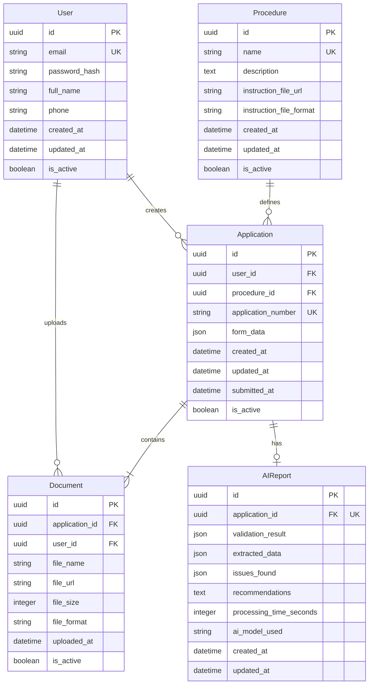

```mermaid
erDiagram
    User ||--o{ Application : "creates"
    User ||--o{ Document : "uploads"
    Procedure ||--o{ Application : "defines"
    Application ||--|{ Document : "contains"
    Application ||--o| AIReport : "has"

    User {
        uuid id PK
        string email UK
        string password_hash
        string full_name
        string phone
        datetime created_at
        datetime updated_at
        boolean is_active
    }

    Procedure {
        uuid id PK
        string name UK
        text description
        string instruction_file_url
        string instruction_file_format
        datetime created_at
        datetime updated_at
        boolean is_active
    }

    Application {
        uuid id PK
        uuid user_id FK
        uuid procedure_id FK
        string application_number UK
        json form_data
        datetime created_at
        datetime updated_at
        datetime submitted_at
        boolean is_active
    }

    Document {
        uuid id PK
        uuid application_id FK
        uuid user_id FK
        string file_name
        string file_url
        integer file_size
        string file_format
        datetime uploaded_at
        boolean is_active
    }

    AIReport {
        uuid id PK
        uuid application_id FK "UK"
        json validation_result
        json extracted_data
        json issues_found
        text recommendations
        integer processing_time_seconds
        string ai_model_used
        datetime created_at
        datetime updated_at
    }
```