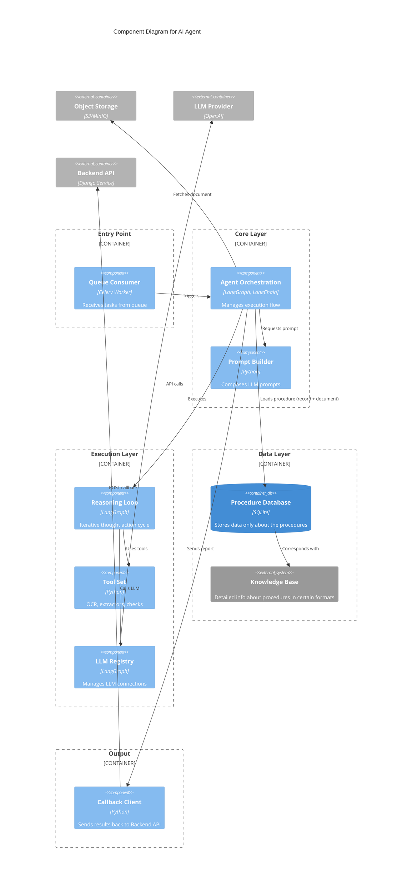

# C4 Component Diagram - AI Agent

## Description

This Component diagram shows the internal structure of the AI Agent system:

### Entry Point Layer
- **Queue Consumer**: Celery Worker that receives tasks from the message queue and triggers the agent orchestration

### Core Layer
- **Agent Orchestration**: LangGraph/LangChain component that manages the overall execution flow
- **Prompt Builder**: Python component that composes prompts for the LLM
- **Callback Client**: Handles communication back to the Backend API

### Execution Layer
- **Reasoning Loop**: LangGraph component implementing iterative thought-action cycles
- **Tool Set**: Python components providing OCR, extractors, and validation checks
- **LLM Registry**: Manages connections to different LLM providers

### Data Layer
- **Procedure Database**: SQLite database storing procedure information
- **Knowledge Base**: External system with detailed procedure information

### Output Layer
- **Callback Client**: Sends results back to the Backend API

### Data Flow
1. Queue Consumer receives tasks and triggers Agent Orchestration
2. Agent Orchestration loads procedures from Procedure Database
3. Agent Orchestration fetches documents from Object Storage
4. Agent Orchestration requests prompts from Prompt Builder
5. Agent Orchestration executes Reasoning Loop
6. Reasoning Loop calls LLM via LLM Registry
7. Reasoning Loop uses tools from Tool Set
8. Results are sent back via Callback Client to Backend API