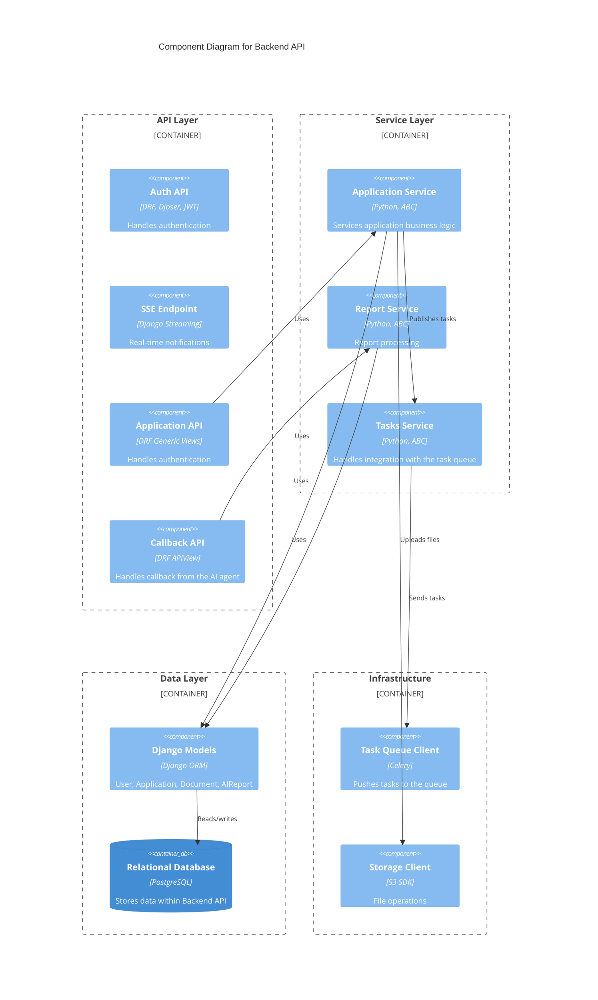

# C4 Component Diagram - Backend API

## Description

This Component diagram shows the internal structure of the Backend API system:

### API Layer
- **Auth API**: Django REST Framework with Djoser and JWT for handling authentication
- **SSE Endpoint**: Django Streaming for real-time notifications to clients
- **Application API**: DRF Generic Views for handling application CRUD operations
- **Callback API**: DRF APIView for handling callbacks from the AI Agent

### Service Layer
- **Application Service**: Python service implementing application business logic with Abstract Base Classes
- **Report Service**: Python service for processing AI reports
- **Tasks Service**: Python service handling integration with the task queue (Celery)

### Data Layer
- **Django Models**: ORM models including User, Application, Document, and AIReport
- **Relational Database**: PostgreSQL database storing all backend data

### Infrastructure Layer
- **Task Queue Client**: Celery client for pushing tasks to the message queue
- **Storage Client**: S3 SDK for file operations with Object Storage

### Data Flow
1. API endpoints receive requests from clients
2. API Layer routes to appropriate Services
3. Services use Django Models for data operations
4. Django Models interact with PostgreSQL database
5. Application Service publishes tasks via Tasks Service to Task Queue Client
6. Application Service uploads files via Storage Client
7. Callback API uses Report Service to process AI agent results