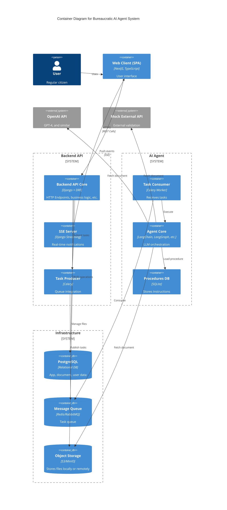

# C4 Container Diagram - Bureaucratic AI Agent System

## Description

This Container diagram shows the detailed architecture of the Bureaucratic AI Agent system:

### Backend API Subsystem
- **Backend API Core**: Django + DRF application handling HTTP endpoints and business logic
- **SSE Server**: Django Streaming for real-time notifications to the web client
- **Task Producer**: Celery integration for publishing tasks to the message queue

### AI Agent Subsystem
- **Task Consumer**: Celery Worker that receives tasks from the queue
- **Agent Core**: LangChain/LangGraph orchestration for LLM processing
- **Procedures DB**: SQLite database storing instructions

### Infrastructure
- **PostgreSQL**: Main relational database for application, document, and user data
- **Message Queue**: Redis/RabbitMQ for task queue management
- **Object Storage**: S3/MinIO for file storage

### External Systems
- **OpenAI API**: GPT-4 and similar LLM services
- **Mock External API**: External validation service

### Data Flow
1. User interacts with Web Client (SPA)
2. Web Client communicates with Backend API Core via HTTPS/REST
3. Backend API Core manages data in PostgreSQL and files in Object Storage
4. Backend API Core publishes tasks via Task Producer to Message Queue
5. Task Consumer retrieves tasks and triggers Agent Core
6. Agent Core loads procedures from Procedures DB and fetches documents
7. Agent Core communicates with external APIs (OpenAI, Mock External API)
8. Results are returned via SSE Server for real-time updates