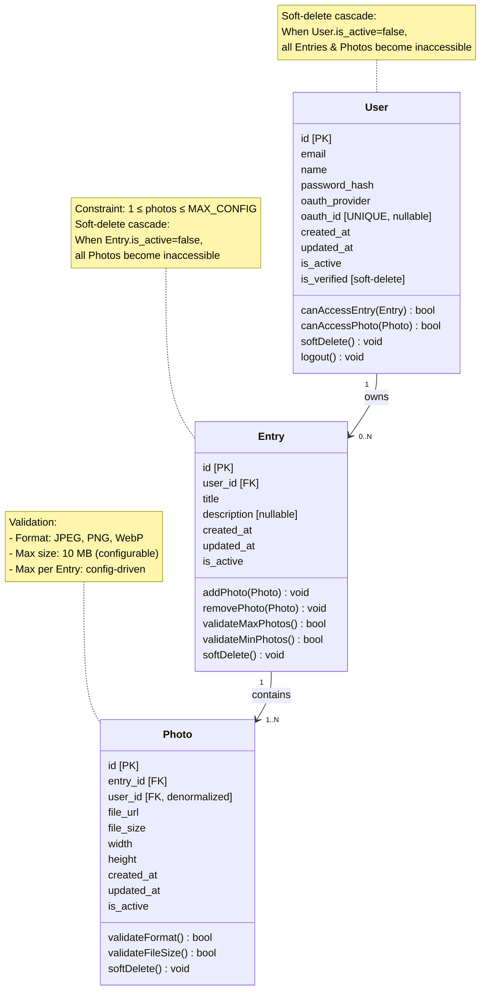

This document complements the general requirements description and formalizes the **data model of the system**, describing the key entities: **User**, **Entry**, and **Photo**.

---

## 0. Context

This document is created as part of designing the educational project **Personal (Remote) Gallery** — a personal remote photo gallery that supports:

* authentication via Google OAuth and Email/Password,
* creating entries (Entry) containing multiple photos,
* private gallery viewing,
* basic editing and deletion.

The sections below describe the **data structures**, **ownership rules**, **life cycle**, and **constraints** for each entity.

---

## 1. User

### 1.1 Purpose

A User represents the unique owner of the gallery.

### 1.2 Fields (Draft Schema)

* `id` — UUID, primary key
* `email` — string, unique, used for identification
* `name` — user name
* `created_at` — datetime
* `updated_at` — datetime
* `is_active` — boolean
* `password` — password hash
* `is_verified` — whether the email is verified
* `oauth_provider` — provider name, default: `google`
* `oauth_id` — unique ID provided by Google

### 1.3 Behavior Rules

* A user cannot see data belonging to other users.
* Authentication is possible either via Google OAuth or Email/Password with confirmation.
* Soft-delete removes:

  * the user,
  * their entries (Entry),
  * their photos (Photo).

### 1.4 Relations

* User **1 → 0…N** Entry
* User **1 → 0…N** Photo (through Entry)

---

## 2. Entry

### 2.1 Purpose

An Entry is a logical post/album that groups one or more photos. It is analogous to a “post” or “gallery”.

### 2.2 Fields (Draft Schema)

* `id` — UUID
* `user_id` — foreign key to User
* `title` — string, required
* `description` — string, optional
* `created_at` — datetime
* `updated_at` — datetime
* `is_active` — boolean

### 2.3 Behavior Rules

* An Entry belongs to exactly one user.
* A user can:

  * create an entry,
  * edit metadata,
  * add and remove photos,
  * delete the entry entirely.
* When an Entry is soft-deleted, all related Photos are also marked as deleted.

### 2.4 Constraints

* At least 1 photo must be present.
* The maximum number of photos is defined by configuration.
* An Entry cannot exist without an owner.

### 2.5 Relations

* Entry **1 → 1…N** Photo
* Entry **N → 1** User

---

## 3. Photo

### 3.1 Purpose

A Photo represents a physical image file uploaded by the user. It may be stored in an Object Storage service (e.g., S3-compatible storage).

### 3.2 Fields (Draft Schema)

* `id` — UUID
* `entry_id` — foreign key to Entry
* `user_id` — duplicated FK for filtering convenience
* `file_url` — string, path to file
* `file_size` — integer
* `width` — integer
* `height` — integer
* `created_at` — datetime
* `updated_at` — datetime
* `is_active` — boolean

### 3.3 Behavior Rules

* A photo belongs to exactly one Entry.
* Deleting an Entry deletes all associated Photos.
* A Photo cannot exist without an Entry.
* The system supports batch (multi-file) upload.
* The system validates file format, size, and quantity.

### 3.4 Constraints (Configurable)

* Maximum file size (e.g., up to 10 MB).
* Allowed formats: JPEG, PNG, WebP.
* Maximum number of photos per Entry.

### 3.5 Additional (Optional, Future)

* EXIF storage,
* thumbnail/preview generation.

---

## 4. Entity Lifecycle

### 4.1 User

login → User.created → normal use → soft delete → inaccessible

### 4.2 Entry

created → updated* → deleted (soft) → inaccessible

### 4.3 Photo

uploaded → available → deleted (soft) → inaccessible

---

## 5. Non-Functional Constraints for Models

* Access to other users’ entities is forbidden → strict `user_id` validation.
* All deletable entities must support soft-delete.
* When using an ORM (Django ORM, SQLAlchemy, etc.), indexes must be supported:

  * by `user_id`,
  * by `entry_id`.

---

## Mermaid Diagram

