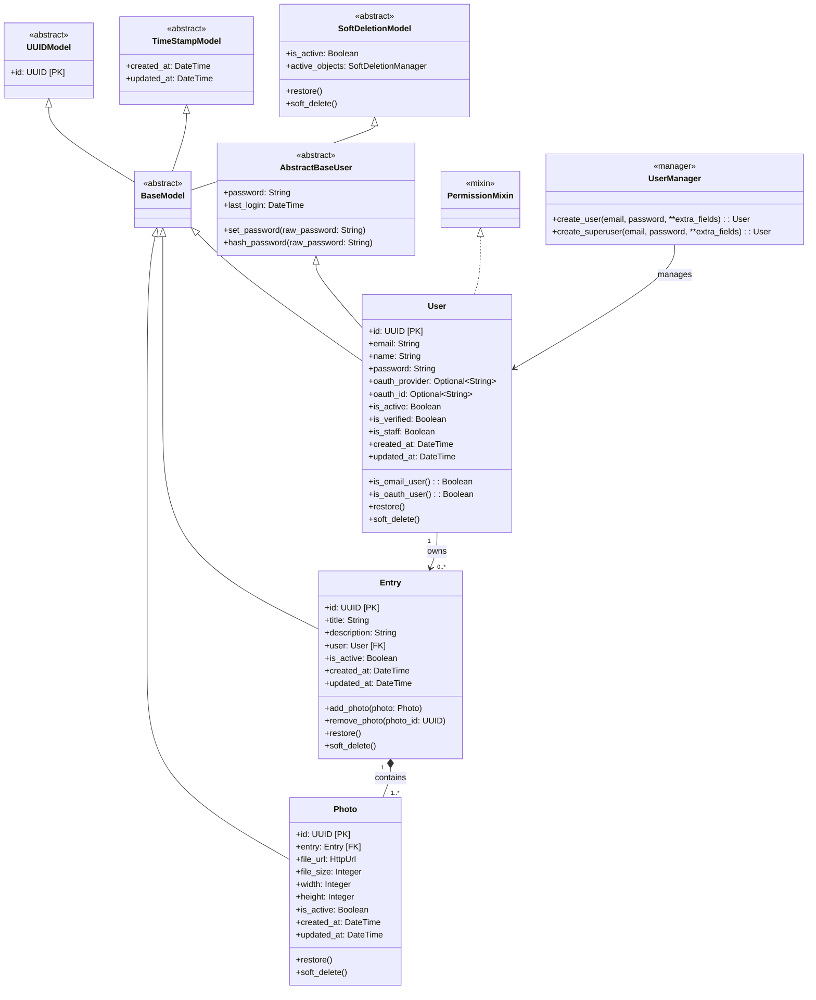

```mermaid
classDiagram
    direction TB
    
    %% Abstract Base Models
    class UUIDModel {
        <<abstract>>
        +id: UUID [PK]
    }
    
    class TimeStampModel {
        <<abstract>>
        +created_at: DateTime
        +updated_at: DateTime
    }
    
    class SoftDeletionModel {
        <<abstract>>
        +is_active: Boolean
        +active_objects: SoftDeletionManager
        +restore()
        +soft_delete()
    }
    
    class BaseModel {
        <<abstract>>
    }
    
    %% Django Base Classes
    class AbstractBaseUser {
        <<abstract>>
        +password: String
        +last_login: DateTime
        +set_password(raw_password: String)
        +hash_password(raw_password: String)
    }
    
    class PermissionMixin {
        <<mixin>>
    }
    
    %% Manager
    class UserManager {
        <<manager>>
        +create_user(email, password, **extra_fields): User
        +create_superuser(email, password, **extra_fields): User
    }
    
    %% Domain Models
    class User {
        +id: UUID [PK]
        +email: String
        +name: String
        +password: String
        +oauth_provider: Optional~String~
        +oauth_id: Optional~String~
        +is_active: Boolean
        +is_verified: Boolean
        +is_staff: Boolean
        +created_at: DateTime
        +updated_at: DateTime
        
        +is_email_user(): Boolean
        +is_oauth_user(): Boolean
        +restore()
        +soft_delete()
    }
    
    class Entry {
        +id: UUID [PK]
        +title: String
        +description: String
        +user: User [FK]
        +is_active: Boolean
        +created_at: DateTime
        +updated_at: DateTime
        
        +add_photo(photo: Photo)
        +remove_photo(photo_id: UUID)
        +restore()
        +soft_delete()
    }
    
    class Photo {
        +id: UUID [PK]
        +entry: Entry [FK]
        +file_url: HttpUrl
        +file_size: Integer
        +width: Integer
        +height: Integer
        +is_active: Boolean
        +created_at: DateTime
        +updated_at: DateTime
        
        +restore()
        +soft_delete()
    }
    
    %% Inheritance
    UUIDModel <|-- BaseModel
    TimeStampModel <|-- BaseModel
    SoftDeletionModel <|-- BaseModel
    
    BaseModel <|-- User
    BaseModel <|-- Entry
    BaseModel <|-- Photo
    
    AbstractBaseUser <|-- User
    PermissionMixin <|.. User
    
    %% Associations
    User "1" --> "0..*" Entry : owns
    Entry "1" *-- "1..*" Photo : contains
    UserManager --> User : manages
```